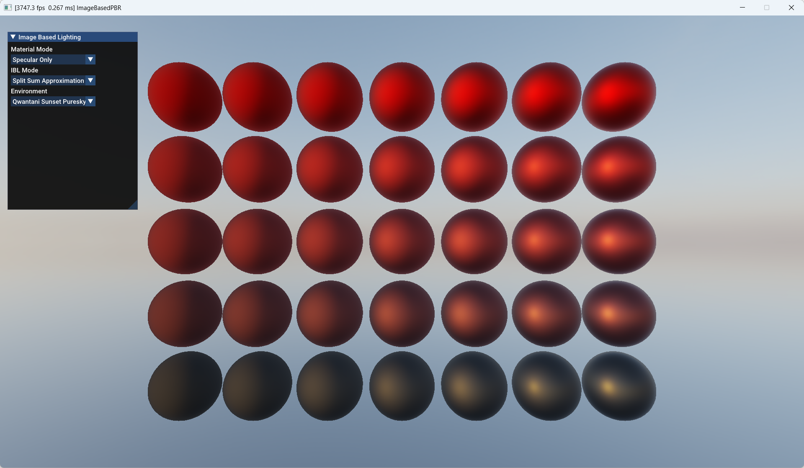
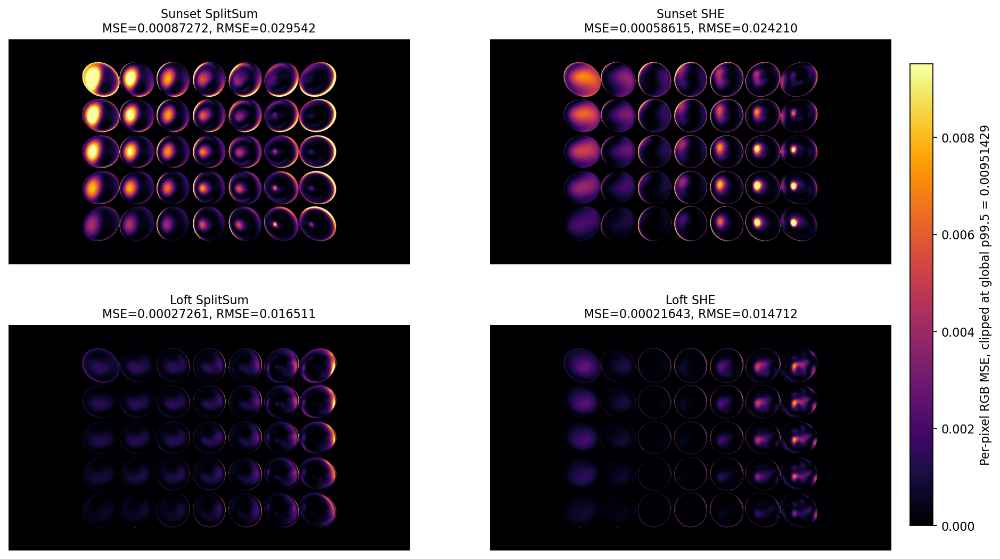

# ImageBasedPBR: Spherical Harmonic Exponentials

Unofficial Direct3D 12 implementation of **Spherical Harmonic Exponentials (SHE)** for glossy image-based lighting, based on:

> **Spherical Harmonic Exponentials for Efficient Glossy Reflections**  
> A. Silvennoinen, P.-P. Sloan, M. Iwanicki, D. Nowrouzezahrai  
> Computer Graphics Forum, Volume 44, Number 8, 2025  
> DOI: <https://doi.org/10.1111/cgf.70219>



## What This Demo Does

The renderer compares three IBL paths:

- **Split-Sum**: standard prefiltered environment map + BRDF LUT approximation.
- **SHE**: fits glossy reflection in log-space with spherical harmonic exponentials.
- **Reference**: stochastic environment sampling used as the comparison target.

The UI supports switching material mode, IBL mode, and HDRI. Changing the HDRI rebuilds the dependent environment data and SHE coefficients.

## Build And Run

Requirements:

- Windows
- Visual Studio 2022 with the **Desktop development with C++** workload
- Direct3D 12 capable GPU

Recommended command-line flow:

```powershell
.\Scripts\build.ps1 -Configuration Debug -Run
```

This script locates MSBuild automatically, builds `Build\ImageBasedPBR.sln`, and starts the executable with the repository root as the working directory so `Data/...` assets resolve correctly.

Other useful commands:

```powershell
.\Scripts\build.ps1 -Configuration Release
.\Scripts\build.ps1 -Configuration Debug -Clean -Run
.\ImageBasedPBRDebug.exe
```

When running the executable manually, launch it from the repository root:

```powershell
Set-Location <repo root>
.\ImageBasedPBRDebug.exe
```

Visual Studio flow:

1. Open `Build\ImageBasedPBR.sln`.
2. Select `Debug|x64` or `Release|x64`.
3. Build or press `F5`. The project sets the debugger working directory to the repository root, so the app can find `Data/...` without launching the `.exe` by hand.

## Implementation

The SHE precomputation is implemented with compute shaders:

- `SHE_Build.hlsl`: samples the environment and builds the fitting system.
- `SHE_Reduction.hlsl`: reduces samples into partial normal equations.
- `SHE_Reduction_Merge.hlsl`: merges partial reductions.
- `SHE_Solve.hlsl`: solves the system with Cholesky decomposition.
- `SHE_Calibrate.hlsl`: computes a log-space brightness compensation term.

Runtime evaluation stores the solved coefficients in a constant buffer. The solve/calibration passes write the same GPU buffer through UAV views, then the forward shader reads it as a CBV.

## Results

Rendered comparisons are stored in `Results/`. Error heatmaps are stored in `Results/Heatmaps/`.

The table below reports RGB MSE against the reference render. Lower is better.

| Environment | Method | MSE | RMSE | MAE |
| --- | --- | ---: | ---: | ---: |
| Sunset | Split-Sum | 0.0008727162 | 0.0295417719 | 0.0129660023 |
| Sunset | SHE | 0.0005861482 | 0.0242104977 | 0.0099544106 |
| Loft | Split-Sum | 0.0002726144 | 0.0165110398 | 0.0074861483 |
| Loft | SHE | 0.0002164342 | 0.0147117032 | 0.0058501605 |



In these two captures, SHE has lower average error than Split-Sum. The improvement is not uniform: local highlights and low-roughness regions can still expose band-limiting and fitting error.

## Current Notes

- The implementation is experimental and meant for studying the paper, not as production renderer code.
- HDRI switching currently performs synchronous precomputation, so the UI can pause during rebuild.
- The fitted SHE representation is most fragile around high-frequency lighting and very sharp reflections.
- Brightness compensation is included because fitting in log-space can bias reconstructed linear radiance.

## License

MIT. See [LICENSE](LICENSE).
